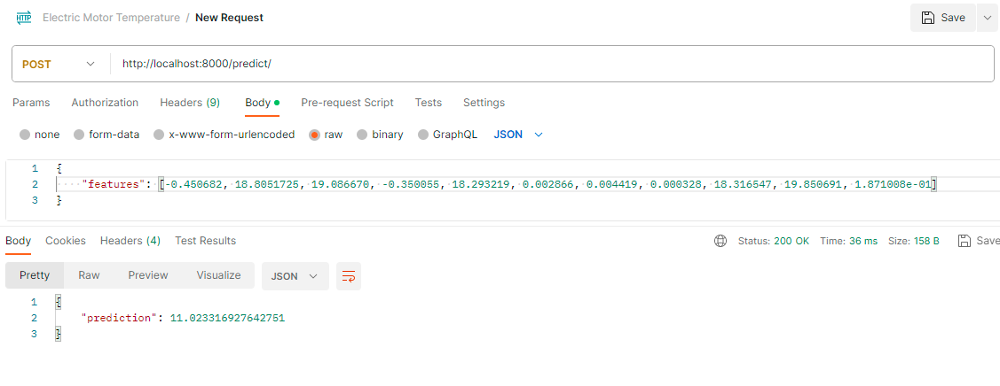
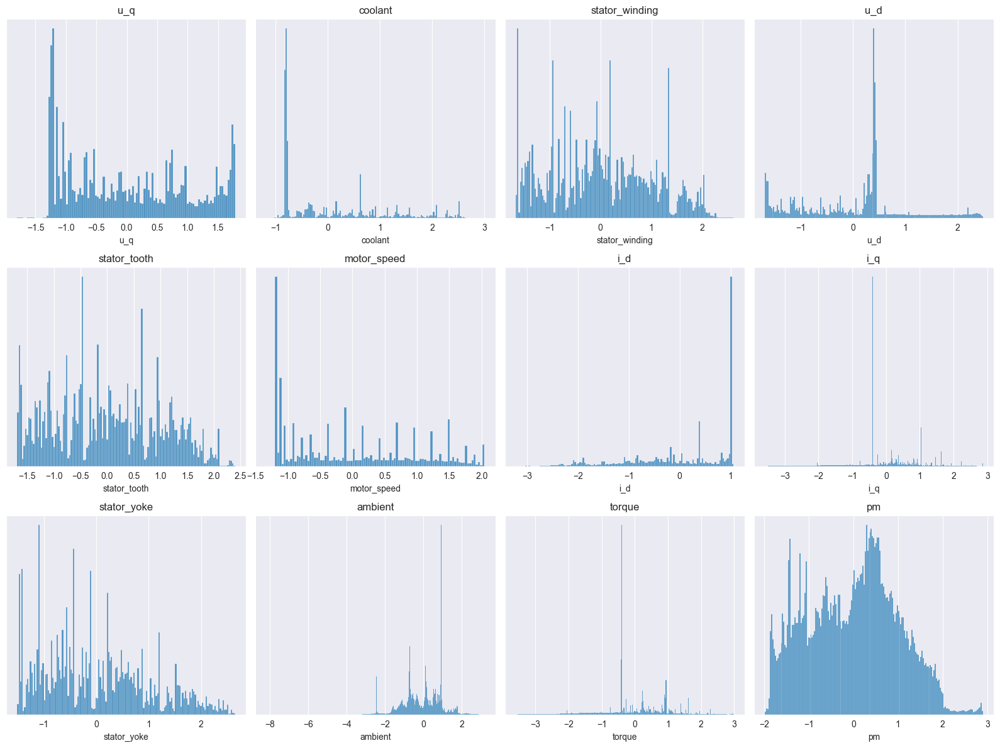
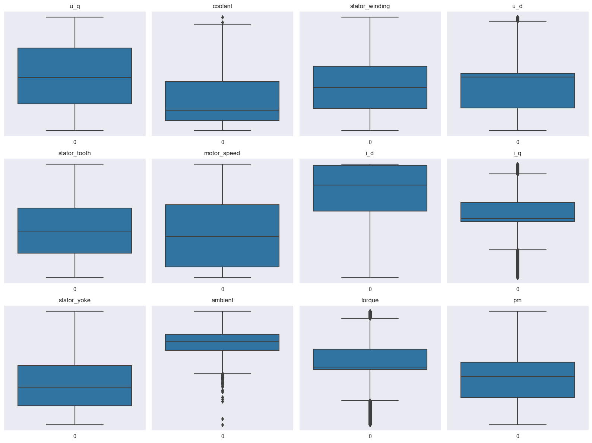
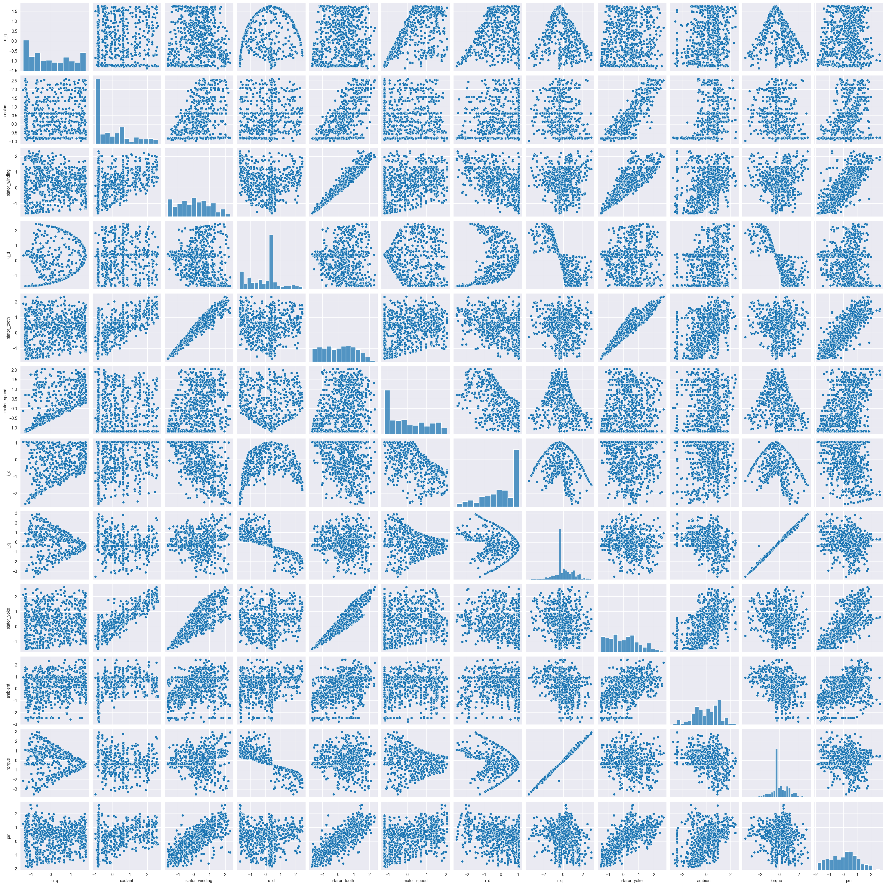
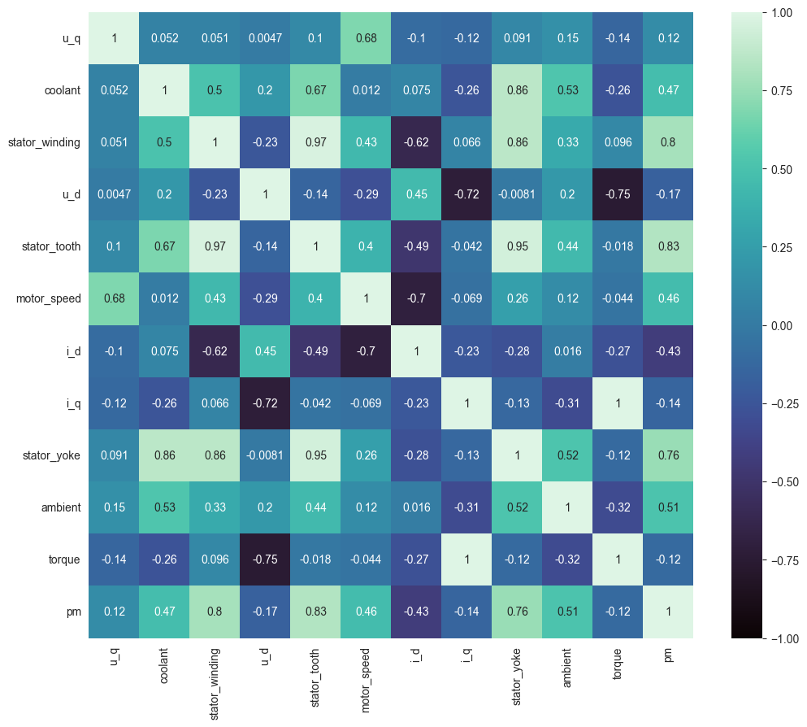

# Electric Motor Temperature Analysis

## Context
The data set comprises several sensor data collected from a permanent magnet synchronous motor (PMSM) deployed on a test bench. The PMSM represents a german OEM's prototype model. Test bench measurements were collected by the LEA department at Paderborn University.

## Content
All recordings are sampled at 2 Hz. The data set consists of multiple measurement sessions, which can be distinguished from each other by column "profile_id". A measurement session can be between one and six hours long.

The motor is excited by hand-designed driving cycles denoting a reference motor speed and a reference torque.
Currents in d/q-coordinates (columns "i_d" and i_q") and voltages in d/q-coordinates (columns "u_d" and "u_q") are a result of a standard control strategy trying to follow the reference speed and torque.
Columns "motor_speed" and "torque" are the resulting quantities achieved by that strategy, derived from set currents and voltages.

Most driving cycles denote random walks in the speed-torque-plane in order to imitate real-world driving cycles to a more accurate degree than constant excitations and ramp-ups and -downs would.

## Project Overview

This project involves the analysis of a dataset using Python's pandas, numpy, matplotlib, seaborn, and sci-kit-learn libraries. The primary goal is to perform exploratory data analysis (EDA) on the provided dataset, preprocess the data, and train a linear regression model for predictive analysis.

## Steps Performed

### Data Loading and Preprocessing
- Load the dataset 'measures_v2.csv' using pandas.
- Drop the 'profile_id' column from the dataset.
- Split the data into features (X) and target variable (y).
- Standardize the features using sci-kit-learn's StandardScaler.
- Standardize the target variable.

### Univariate Analysis
- Generate histograms for each feature and the target variable.
- Generate box plots for each feature and the target variable.

### Multivariate Analysis
- Create a pair plot for a subset of the dataset.

### Correlation Heatmap
- Calculate the correlation matrix of features and the target variable.
- Generate a correlation heatmap using Seaborn.

### Model Training and Evaluation
- Split the standardized data into training and testing sets.
- Initialize a linear regression model.
- Train the model on the training data.
- Print the R^2 score of the model on the test data.
- Serialize and save the trained model as 'linear_regression_model.pickle.

## Results:
Using Grid-Search, the best r^2 score across all different models I could find is 0.8541.

## API:
- The API used for prediction was implemented using FastAPI, here is a prediction example using Postman:
- 

## Interpretation

- 
  The distribution plot shows that most of the columns present a normal distribution; specifically, the column we are trying to predict is a normal distribution.

- 
  The box plot shows that there aren't many outliers in our data.

- 
  The pair plot reveals strong correlations between certain features. While considering feature selection, note that some features exhibit significant interdependence.

- 
  The heatmap visually confirms the correlations observed in the pair plot. Strong positive and negative correlations are highlighted, further emphasizing the need for careful feature consideration.

## Dataset
You can find the dataset [here](https://www.kaggle.com/datasets/wkirgsn/electric-motor-temperature).

## Author
Zakaria Akerdad

